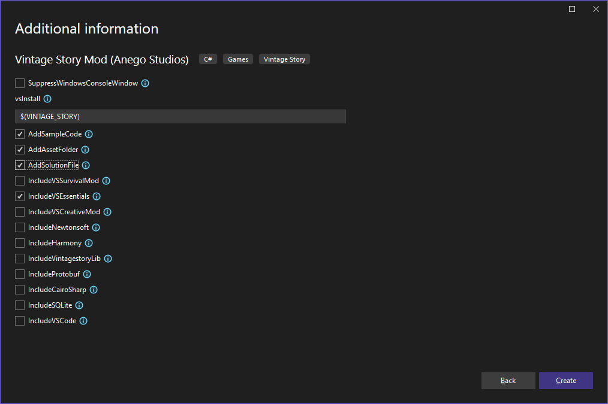

# vsinstruments_quackpack
 
This mod contains the models, sounds and other necessary code 
for adding instruments to the VSInstruments mod.

## I want to make my own instruments, what do I need?
To make your own instruments, you will need:
+ The sound files for your instrument

+ The model for your instrument
    - I recommend looking into the [VS Model Creator](https://wiki.vintagestory.at/Modding:VS_Model_Creator)
    - I have used textures from in the game, but you can of course use your own
+ The recipe for creating the instrument in-game    
    - This might be in the crafting grid or through smithing
    - For examples, look at other mods (or this one)
+ The 'itemtype' file
    - This gives instructions for how the instrument is held or placed in the game, you just need it
+ A language file   
+ Some c# code to tie everything together

If you think you can do all this, great! Let's get started.

## Making your new mod
Follow [tutorials on the wiki on how to make your own mod](https://wiki.vintagestory.at/Modding:Code_Mods). 
If you're new to this, there's a LOT of new things you will learn, but that's part of the fun!

Once your environment is set up and you have the mod template, we can continue.
When making your mod, make sure you select the following options: 
You'll also need the vsinstruments_base.dll so that your new code knows what an instrument is.
+ Download the vsinstruments_base mod if you haven't already
+ Locate 'vsinstruments_base.dll' within the zipped folder

In your programming IDE, add this dll as a dependency. In Visual Studio, right-click 'Dependencies' within the Solution Explorer,
Add Project Reference -> Browse, click the dll, Accept.
You can tell if this worked by importing 'instruments' in you .cs file (at the top of the file, type 'using instruments;')

**One last thing**: Once the dependency is added, one setting needs to be modified. In the Solution Explorer, find
Dependencies -> Assemblies -> vsinstruments_base -> properties. Set 'Copy Local' to false or No.

**Another last thing**: in your assets folder, make a folder called instruments. All assets folders (sounds, itemtypes etc)
must be placed in this folder, as the code expects it.

Alright, that was the weird part over. Now onto the fun stuff.

## Naming your instrument
Choose a name for your instrument. This will be used by the code in a number of places, so it must be consistent.

## Adding the instrument itemtype
Copy one of the itemtypes from the QuackPack, just to get started. Place it in assets/instruments/itemtypes/"your_instrument".json.
Change the "code" to "your_instrument", the "class" to "your_instrument", and "shape" to item/"your_instrument".
You will change some more of these numbers later, but for now let's get this working.

## Adding a shape
If you already have your own model, great! Otherwise, we can borrow one of the existing QuackPack ones.
Place your model into assets/instruments/shapes/item/"your_instrument".json. And that's it!

## Adding the instrument into the game
Now for some code.
In your c# you created from the template, well, delete all that. Copy the code in "vsinstruments_quackpack.cs" and slap that
right in. Rename your namespace if you'd like as well.

First, we need a new InstrumentItem class. Remove all but one of the InterumentItem classes, and rename the remaining class
as "your_instrument"Item. The name of this class **does not have to match "your_instrument"**, but make it something sensible.
Rename the instrument variable to "your_instrument", and set the animation to whatever you need it to be. This can be decided later, of course.
Now that we have an IntsrumentItem, we need to register it. In the ModSystem's Start() function remove all but one of the 
"api.RegisterItemClass(...)" lines. In the remaining line, replace the name of the instrument with your "your_instrument", and
the typeof() with your new InstrumentItem.

Now we have enough to test! Run your mod, create a new creative mod map, and try finding your new instrument in the creative menu.
If you try to play your instrument, it sadly won't make a sound. Let's change that!

## Adding sounds
Create a folder assets/instruments/sounds/"your_instrument".
In this folder, place your .ogg files. If you don't have those yet, you can borrow them from another instrument, just copy and paste.
- Each note needs to be the key 'a'
- Each file needs to be in the 'ogg' format
- Each file must be named 'a0.ogg', 'a1.ogg' ... 'a7.ogg'

Test this out in game, see if it plays your sounds!

## Adding a recipe
Adding recipes the same as for any other item. [Follow this tutorial on how to do it for your new item.](https://wiki.vintagestory.at/Modding:Content_Tutorial_Simple_Recipe/en)
Recipes go in assets/instruments/recipes/grid or smithing/"your_instrument".json.

## Adding a lang file
You will need at least one lang file. Follow other tutorials/mods on how to do this.

I think that's it, you have everything you need to make your own instruments! Toot on!
